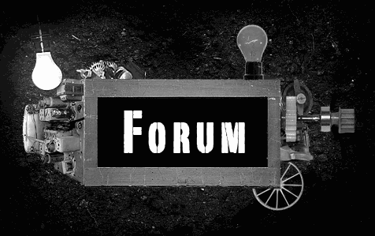

    <h1><em>Becorum , le forum</em></h1>
    
    <h2>Par :</h2>
    
    
Un forum réalisé pour le workshop qui me va me servir pour l'acquisition de mon badge laravel 2 . 
    Vous y trouverez tout le CRUD, et aussi de l'authentification pour là quel j'ai refait quelques blades aussi. 
    

    

    <h2><strong>le projet publier</strong></h2>
    <a href="http://becorum.delvauxrobby.yj.fr/">Becorum</a>
    

    <h2>Me contacter</h2>
    <ol>
    <li><a href="https://delvauxrobby.yj.fr/">Mon site web</a></li>
    <li><a href="https://www.linkedin.com/in/robby-delvaux-1ab1a51ab/">Linkedin</a></li>
    </ol>

